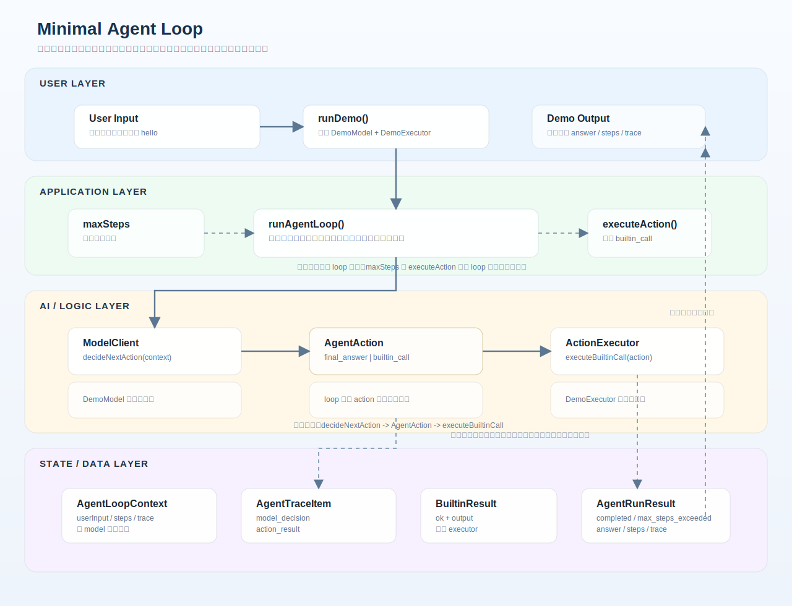

# Architecture v0.0.1

## 说明

这是当前项目的初始架构文档目录。

当前这个版本的核心主题是：最小可运行的 agent loop。

它围绕 4 个核心角色展开：

- `ModelClient`：只读取 `ModelContextView`，决定下一步动作
- `ActionExecutor`：执行 `builtin_call`，并接收最小 `ExecutionContext`
- `AgentLoop`：持有真实 `AgentSessionState`，负责循环推进、`maxSteps`、`trace` 和终止
- `AgentAction`：当前统一为 `final_answer | builtin_call`

## 当前架构图

架构图文件：`docs/architecture/v0.0.1/minimal-agent-loop-architecture.svg`

## 当前数据流

1. 用户输入传给 `runDemo()`
2. `runDemo()` 组装 `DemoModel` 和 `DemoExecutor`
3. `runAgentLoop()` 创建并持有 `AgentSessionState`
4. loop 派生只读 `ModelContextView` 后调用 `model.decideNextAction(context)`
5. 如果拿到 `final_answer`，立即结束
6. 如果拿到 `builtin_call`，派生 `ExecutionContext` 后交给 `executor.executeBuiltinCall(action, context)`
7. loop 记录 `model_decision` 和 `action_result` 到 `trace`
8. 达到 `maxSteps` 仍未完成时，返回 `max_steps_exceeded`

## 代码映射

- `src/agent/agent-loop.ts`
- `src/agent/model-client.ts`
- `src/agent/action-executor.ts`
- `src/agent/types.ts`
- `src/demo/demo-model.ts`
- `src/demo/demo-executor.ts`
- `src/demo/run-demo.ts`

## 维护规则

- 本目录中的架构文档需要同时包含文字说明和架构图。
- 架构图应能直观看清模块边界、关系和数据流。
- 这个版本内的小改动，直接更新本目录下的文档
- 如果架构发生明显阶段性变化，新增下一个版本目录，而不是把所有历史揉在一起
