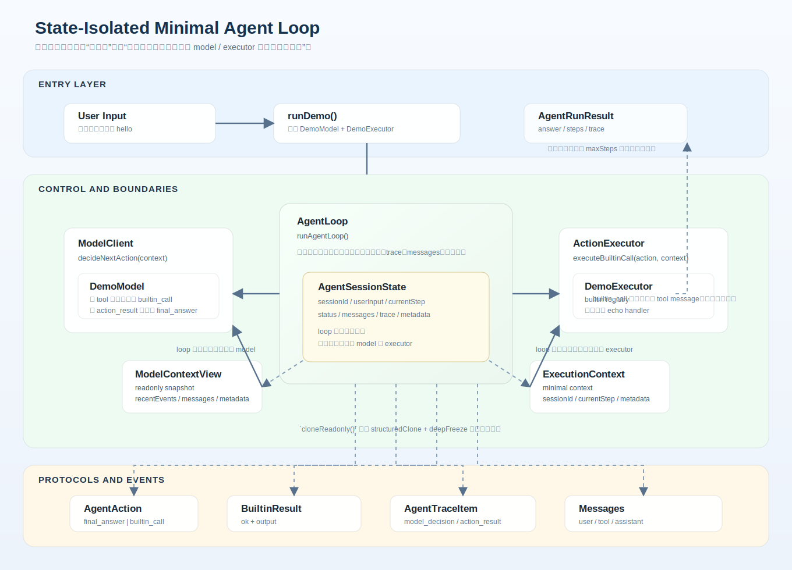

# Architecture v0.0.2

## 说明

这是当前项目的第二个架构版本目录。

这一版的核心主题是：带状态隔离边界的最小 agent loop。

相对 `v0.0.1`，这版不再只描述一个能跑通的最小循环，而是明确当前实现中的状态所有权和对外暴露边界：

- `AgentLoop` 内部持有真实 `AgentSessionState`
- `ModelClient` 只读取只读快照 `ModelContextView`
- `ActionExecutor` 只拿到最小执行上下文 `ExecutionContext`
- loop 在内部维护 `messages`、`trace`、`sessionId` 和 `metadata`

## 当前架构图

架构图文件：`docs/architecture/v0.0.2/state-isolated-agent-loop-architecture.svg`

## 相对 v0.0.1 的演进点

1. `AgentLoop` 不只是控制流程，还成为唯一真实状态持有者。
2. model 侧上下文从概念上的最小 loop context，演进为只读 `ModelContextView`。
3. executor 侧显式引入 `ExecutionContext`，把执行时允许访问的信息限制到最小集合。
4. loop 内部新增 `messages` 轨迹，分别记录：
   - 初始 `user` message
   - builtin 执行后的 `tool` message
   - 完成时的 `assistant` message
5. `metadata` 和 `sessionId` 已经成为 session 级数据的一部分。
6. 只读视图和执行上下文都通过克隆加冻结的方式派生，避免 model 和 executor 直接修改 loop 内部状态。

## 当前核心角色

- `ModelClient`：基于 `ModelContextView` 决定下一步 `AgentAction`
- `ActionExecutor`：执行 `builtin_call`，返回 `BuiltinResult`
- `AgentLoop`：持有 `AgentSessionState`，推进循环、记录结构化事件、维护消息历史并负责终止
- `AgentAction`：当前统一为 `final_answer | builtin_call`
- `AgentSessionState`：loop 内部真实状态，包含 `sessionId`、`currentStep`、`status`、`messages`、`trace`、`metadata`
- `ModelContextView`：提供给 model 的只读快照
- `ExecutionContext`：提供给 executor 的最小执行上下文

## 当前数据流

1. 用户输入传给 `runDemo()`
2. `runDemo()` 组装 `DemoModel` 和带 builtin registry 的 `DemoExecutor`
3. `runAgentLoop()` 初始化 `AgentSessionState`
4. loop 先写入初始 `user` message，并保存 `sessionId` / `metadata`
5. 每一轮先从当前 state 派生只读 `ModelContextView`
6. `model.decideNextAction(context)` 返回 `final_answer` 或 `builtin_call`
7. loop 把本轮决策记录为 `model_decision`
8. 如果是 `final_answer`
   - loop 写入 `assistant` message
   - 返回 `completed`
9. 如果是 `builtin_call`
   - loop 派生最小 `ExecutionContext`
   - `executor.executeBuiltinCall(action, context)` 返回 `BuiltinResult`
   - loop 记录 `action_result`
   - loop 追加 `tool` message
   - `currentStep` 加一后继续下一轮
10. 达到 `maxSteps` 仍未完成时，返回 `max_steps_exceeded`

## 代码映射

- `src/agent/agent-loop.ts`
- `src/agent/model-client.ts`
- `src/agent/action-executor.ts`
- `src/agent/types.ts`
- `src/demo/demo-model.ts`
- `src/demo/demo-executor.ts`
- `src/demo/run-demo.ts`
- `tests/agent/agent-loop.test.ts`

## 当前实现边界

- 真实模型 client 还未接入，当前仍使用 `DemoModel`
- builtin 能力仍是最小注册表形式，当前只演示 `echo`
- 错误处理仍保持学习型最小实现，loop 不吞掉 executor 异常
- action 类型仍只有 `final_answer` 和 `builtin_call`

## 维护规则

- 本目录中的架构文档需要同时包含文字说明和架构图。
- 架构图应能直观看清模块边界、状态所有权和数据流。
- 这个版本内的小改动，直接更新本目录下的文档。
- 如果架构发生明显阶段性变化，新增下一个版本目录，而不是把所有历史揉在一起。
