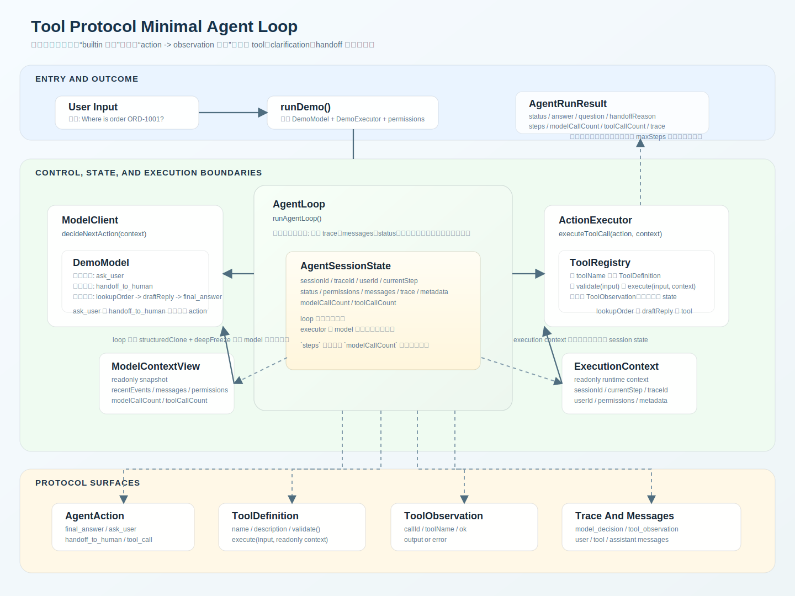

# Architecture v0.0.3

## 说明

这是当前项目的第三个架构版本目录。

这一版的核心主题是：把 tool calling 从“调用一个 builtin 函数”，收紧为稳定的 action-to-observation protocol。

相对 `v0.0.2`，这版的重点不再只是状态隔离，而是进一步明确 5 条稳定边界：

- `AgentAction`：模型统一输出面，包含 `final_answer`、`ask_user`、`handoff_to_human`、`tool_call`
- `ToolDefinition`：工具协议定义，负责描述、校验、执行
- `ExecutionContext`：只读执行上下文，提供 `traceId`、`userId`、`permissions` 等运行时信息
- `ToolObservation`：工具执行结果的统一返回面
- `AgentLoop`：唯一状态推进者，负责把 observation 归档进 `trace` 和 `messages`

这一版也明确了一个产品级判断：

- `tool` 只是 `action` 的一种
- 追问用户和转人工不应伪装成 tool

## 当前架构图

架构图文件：`docs/architecture/v0.0.3/tool-protocol-agent-loop-architecture.svg`

## 相对 v0.0.2 的演进点

1. `builtin_call` 被 `tool_call` 取代，tool action 显式携带 `callId` 和 `toolName`。
2. action 面从 `final_answer | builtin_call` 演进为 `final_answer | ask_user | handoff_to_human | tool_call`。
3. executor 不再返回松散的 `BuiltinResult`，而是统一返回 `ToolObservation`。
4. `ActionExecutor` 的最小实现从 demo builtin handler 演进为 `ToolRegistry`，并通过 `ToolDefinition.validate()` 收紧 `unknown` 输入。
5. `ExecutionContext` 从最小 session 信息扩展为只读运行时上下文，包含 `traceId`、`userId`、`permissions`、`metadata`。
6. loop 仍然拥有唯一的 state 写权限；executor 不能直接改 `messages`、`trace`、`status`。
7. session 结果新增 `modelCallCount` 和 `toolCallCount`，把决策轮次和工具执行次数拆开记录。
8. demo 场景从 `echo` builtin 改成客服流程，包含 `lookupOrder`、`draftReply`、`ask_user`、`handoff_to_human`。

## 当前核心角色

- `ModelClient`：基于 `ModelContextView` 决定下一步 `AgentAction`
- `ToolRegistry`：按 `toolName` 查找 `ToolDefinition`，执行 `validate()` 和 `execute()`
- `ActionExecutor`：当前抽象的执行边界，统一执行 `tool_call` 并返回 `ToolObservation`
- `AgentLoop`：持有 `AgentSessionState`，推进循环、记录结构化事件、维护消息历史并负责终止
- `AgentAction`：当前统一动作面，包含工具动作和非工具动作
- `ToolDefinition`：单个工具的协议定义
- `ExecutionContext`：executor 可读但不可写的运行时上下文
- `ToolObservation`：工具执行返回的统一 observation
- `AgentSessionState`：loop 内部真实状态，包含 `sessionId`、`traceId`、`currentStep`、`status`、`messages`、`trace`、`permissions`、计数器等

## 当前数据流

1. 用户输入传给 `runDemo()`
2. `runDemo()` 组装 `DemoModel` 和 `DemoExecutor`，并注入 `orders:read` 权限
3. `runAgentLoop()` 初始化 `AgentSessionState`
4. loop 先写入初始 `user` message，并保存 `sessionId`、`traceId`、`permissions`、`metadata`
5. 每一轮先从当前 state 派生只读 `ModelContextView`
6. `model.decideNextAction(context)` 返回一个 `AgentAction`
7. loop 记录 `model_decision`，并更新 `modelCallCount`
8. 如果 action 是 `final_answer`
   - loop 写入 `assistant` message
   - 返回 `completed`
9. 如果 action 是 `ask_user`
   - loop 写入 `assistant` clarification message
   - 返回 `needs_user_input`
10. 如果 action 是 `handoff_to_human`
    - loop 写入 `assistant` handoff message
    - 返回 `handoff_requested`
11. 如果 action 是 `tool_call`
    - loop 派生只读 `ExecutionContext`
    - `executor.executeToolCall(action, context)` 返回 `ToolObservation`
    - loop 记录 `tool_observation`
    - loop 追加 `tool` message
    - loop 更新 `toolCallCount`，然后进入下一轮
12. 达到 `maxSteps` 仍未终止时，返回 `max_steps_exceeded`

## 客服 demo 行为

- 缺订单号时，`DemoModel` 返回 `ask_user`
- 输入包含欺诈、律师、chargeback 等高风险信号时，`DemoModel` 返回 `handoff_to_human`
- 正常订单查询时，模型先发出 `lookupOrder`，拿到 observation 后再发出 `draftReply`
- 当两次 tool observation 都成功后，模型才返回 `final_answer`

这个 demo 用来强调：

- 订单查询和回复草稿属于 tool
- 澄清和人工接管属于 control action，不属于 tool

## 代码映射

- `src/agent/types.ts`
- `src/agent/action-executor.ts`
- `src/agent/model-client.ts`
- `src/agent/agent-loop.ts`
- `src/demo/demo-model.ts`
- `src/demo/demo-executor.ts`
- `src/demo/run-demo.ts`
- `tests/agent/agent-loop.test.ts`

## 当前实现边界

- 真实模型输出的结构化 action 还未接入，当前仍使用 `DemoModel`
- `ToolDefinition` 目前仍是本地内存注册表，尚未引入 MCP、远程 provider 或审批拦截
- `currentStep` 仍是 loop 内部游标，`AgentRunResult.steps` 通过 `modelCallCount` 表示决策轮次
- observation 已统一，但 trace/logging 还未做更细粒度的 observability 字段设计
- 客服 demo 仍是本地 fixture，不包含真实订单系统接入

## 维护规则

- 本目录中的架构文档需要同时包含文字说明和架构图。
- 架构图应能直观看清模块边界、协议边界、状态所有权和数据流。
- 这个版本内的小改动，直接更新本目录下的文档。
- 如果架构发生明显阶段性变化，新增下一个版本目录，而不是把所有历史揉在一起。
