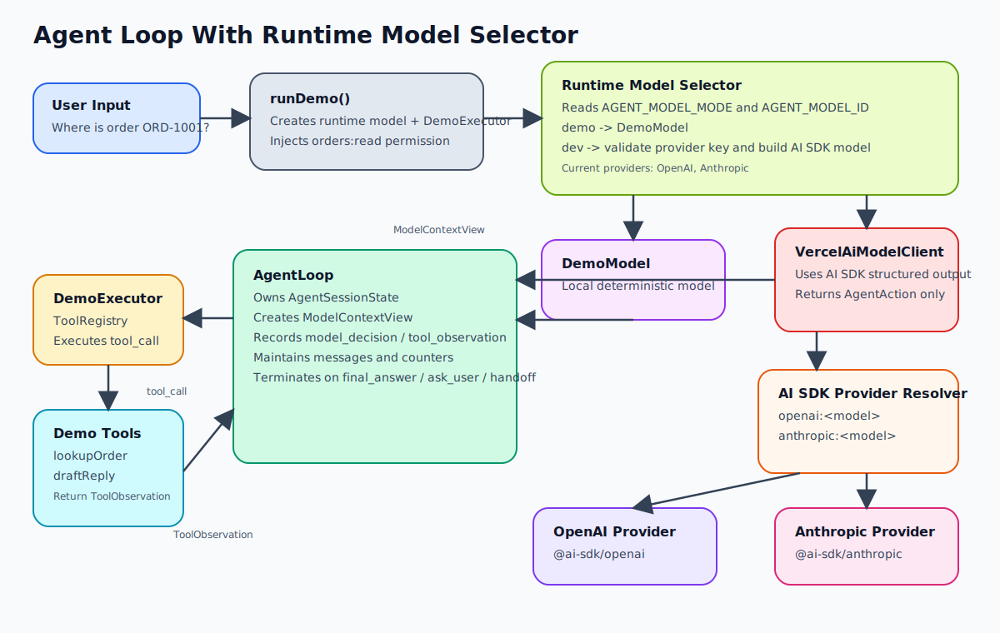

# Architecture v0.0.4

## 说明

这是当前项目的第四个架构版本目录。

这一版的核心主题是：在不改动 `AgentLoop` 和 tool protocol 的前提下，引入一个可切换的模型接入层。

相对 `v0.0.3`，这版新增了两个明确判断：

- `demo` 模式继续保留本地 `DemoModel`，确保仓库始终可以零配置跑通
- `dev` 模式通过 `Vercel AI SDK` 接入真实模型，但真实模型仍然只负责“决定下一步动作”，不直接接管工具执行

## 当前架构图

架构图文件：`docs/architecture/v0.0.4/model-runtime-agent-loop-architecture.svg`

## 相对 v0.0.3 的演进点

1. `runDemo()` 不再直接硬编码 `DemoModel`，而是先走 runtime model selector。
2. 新增 `AGENT_MODEL_MODE=demo|dev`，把“本地 demo”和“真实模型开发态”明确拆开。
3. 新增 `RuntimeModelConfig`，统一解析 `AGENT_MODEL_ID`、provider 前缀和对应 API key。
4. 新增 `VercelAiModelClient`，使用 AI SDK 的结构化输出能力把真实模型结果映射为统一 `AgentAction`。
5. 新增 provider resolver，当前内置 `OpenAI` 和 `Anthropic` 两家官方 provider。
6. tool execution 边界保持不变，`lookupOrder` 和 `draftReply` 仍然由 `DemoExecutor` 执行。

## 当前核心角色

- `RuntimeModelConfig`：解析环境变量，决定当前运行模式和 dev 模式下的 provider 配置
- `RuntimeModelSelector`：根据配置返回 `DemoModel` 或 `VercelAiModelClient`
- `VercelAiModelClient`：把 `ModelContextView` 编排成 prompt，并要求真实模型输出结构化 `AgentAction`
- `ProviderResolver`：把 `openai:<model>` 或 `anthropic:<model>` 解析成 AI SDK language model
- `AgentLoop`：继续作为唯一状态推进者，拥有 state、messages、trace 和终止条件
- `DemoExecutor`：继续执行本地 `lookupOrder` 和 `draftReply`

## 当前数据流

1. 用户输入传给 `runDemo()`
2. `runDemo()` 调用 runtime model selector
3. 如果 `AGENT_MODEL_MODE=demo`
   - selector 返回 `DemoModel`
4. 如果 `AGENT_MODEL_MODE=dev`
   - selector 解析 `AGENT_MODEL_ID`
   - selector 校验对应 provider 的 API key
   - selector 返回 `VercelAiModelClient`
5. `runDemo()` 继续组装 `DemoExecutor` 和 `orders:read` 权限
6. `runAgentLoop()` 初始化 `AgentSessionState`
7. 每一轮 loop 都派生只读 `ModelContextView`
8. `DemoModel` 或 `VercelAiModelClient` 返回一个统一 `AgentAction`
9. 如果 action 是 `tool_call`
   - loop 仍然交给 `DemoExecutor`
   - tool 返回 `ToolObservation`
   - loop 写入 trace 和 tool message
10. 如果 action 是 `final_answer` / `ask_user` / `handoff_to_human`
    - loop 直接终止并返回结果

## 设计边界

- `VercelAiModelClient` 只存在于模型边界，不进入 `AgentLoop`
- 真实模型输出的是结构化动作，不是直接修改 session state
- AI SDK provider 的差异被限制在 runtime model selector 内部
- 新增 provider 时，只需要扩展模型接入层，不需要改 `AgentLoop` 和 executor
- `demo` 模式始终保留，确保仓库可学习、可对比、可离线理解

## 代码映射

- `src/model/runtime-config.ts`
- `src/model/runtime-model.ts`
- `src/model/vercel-ai-model-client.ts`
- `src/demo/run-demo.ts`
- `src/demo/demo-tool-catalog.ts`
- `tests/agent/model-runtime.test.ts`

## 当前实现边界

- 当前 dev 模式只内置 `OpenAI` 和 `Anthropic`
- AI SDK 侧只使用了结构化输出，不包含流式 UI、middleware、telemetry 等高级能力
- 当前 tool catalog 仍是 demo 级描述，不是通用 schema registry
- README 中的“接入我的模型”目前是以扩展 runtime resolver 为入口，不是自动发现 provider

## 维护规则

- 本目录中的架构文档需要同时包含文字说明和架构图。
- 架构图应能直观看清 runtime model selector、provider 边界、状态所有权和数据流。
- 这个版本内的小改动，直接更新本目录下的文档。
- 如果架构发生明显阶段性变化，新增下一个版本目录，而不是把所有历史揉在一起。
