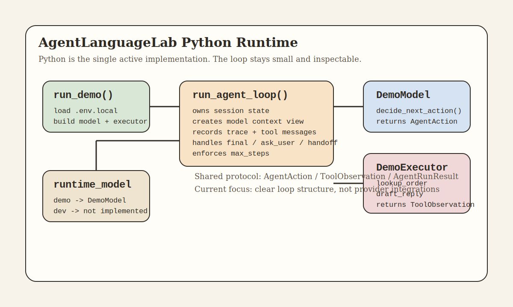

# Architecture v0.0.5

## 说明

这是当前项目的第五个架构版本目录。

这一版的核心主题是：把仓库收敛为 Python 单实现，保留最小、清晰、可运行的 agent loop 学习骨架。

## 当前架构图

架构图文件：`docs/architecture/v0.0.5/python-agent-loop-architecture.svg`

## 当前核心角色

- `agent_language_lab.agent.types`：定义动作协议、上下文、trace 和运行结果
- `agent_language_lab.agent.model_client`：定义模型决策接口
- `agent_language_lab.agent.action_executor`：定义工具执行接口和最小注册表
- `agent_language_lab.agent.agent_loop`：唯一状态推进者
- `agent_language_lab.demo.demo_model`：本地、可预测的客服决策逻辑
- `agent_language_lab.demo.demo_executor`：执行 `lookupOrder` 和 `draftReply`
- `agent_language_lab.model.runtime_config`：读取运行模式配置
- `agent_language_lab.model.runtime_model`：当前只负责在 `demo` 模式返回 `DemoModel`
- `agent_language_lab.shared.serialization`：把 dataclass、mapping 和 trace 转成 JSON 友好结构

## 当前数据流

1. 用户输入进入 `run_demo()`
2. `run_demo()` 读取 `.env.local` 并选择 runtime model
3. 当前实现下：
   - `AGENT_MODEL_MODE=demo` 返回 `DemoModel`
   - `AGENT_MODEL_MODE=dev` 明确报出未实现，避免假装已接通真实模型
4. `run_agent_loop()` 初始化 `AgentSessionState`
5. 每一轮 loop 派生 `ModelContextView`
6. `DemoModel` 返回一个 `AgentAction`
7. 如果动作是 `tool_call`
   - loop 调用 `DemoExecutor`
   - executor 返回 `ToolObservation`
   - loop 写入 trace 和 tool message
8. 如果动作是 `final_answer` / `ask_user` / `handoff_to_human`
   - loop 直接终止并返回结果

## 设计边界

- 当前版本不引入第三方 agent 框架
- 当前版本不引入真实模型 SDK，避免把学习重点转移到 provider 细节
- `run_agent_loop()` 是唯一状态推进者
- model 不直接执行工具
- executor 不决定下一步动作
- context 传递采用防御性快照，避免 loop 内状态被外部复用

## 代码映射

- `agent_language_lab/agent/types.py`
- `agent_language_lab/agent/model_client.py`
- `agent_language_lab/agent/action_executor.py`
- `agent_language_lab/agent/agent_loop.py`
- `agent_language_lab/demo/demo_model.py`
- `agent_language_lab/demo/demo_executor.py`
- `agent_language_lab/demo/run_demo.py`
- `agent_language_lab/model/runtime_config.py`
- `agent_language_lab/model/runtime_model.py`
- `agent_language_lab/shared/serialization.py`
- `python_tests/test_agent_loop.py`

## 当前实现边界

- 当前只支持 `demo` 模式完整运行
- 当前不接 OpenAI / Anthropic SDK
- 当前重点是把核心 agent loop 结构、状态推进和 demo 例子跑通
- 等 Python loop 稳定后，再补真实模型结构化输出接入

## 维护规则

- 这个版本目录用于描述当前 Python 实现。
- 如果只是当前边界内的小调整，直接更新本目录文档。
- 如果新增真实模型接入、架构边界明显变化，再进入下一个版本目录。
